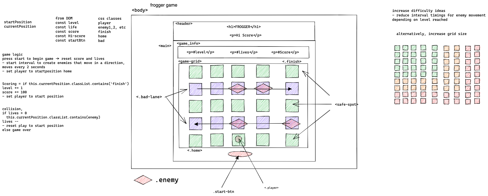
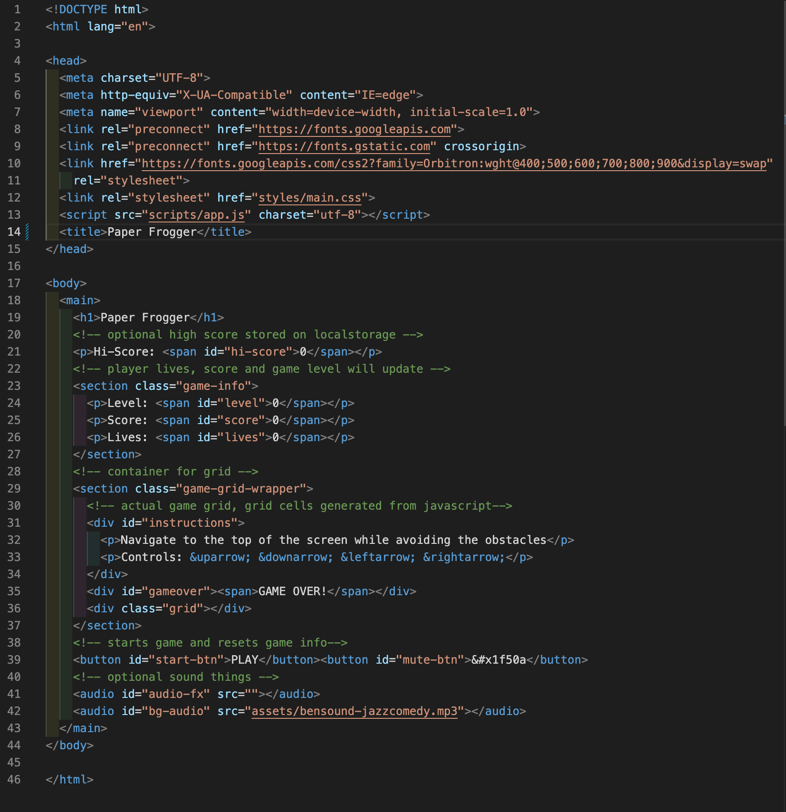
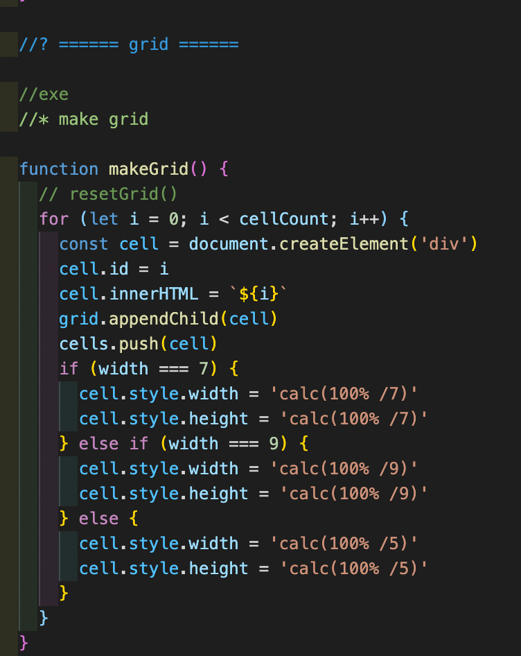
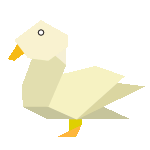

Dev Journal
# Dev Journal

### Approach

#### Day 1 - Planning 

I initially didn’t have a particular theme in mind so I started with a basic wire frame on what I wanted the game to look like structure wise and consider what features the game should have.

My approach
1. Setup html Structure
2. Do basic styling
3. Work on grid creation and player movement
4. Setup start and finish areas on the grid, checked they are properly logged
5. Add win condition and update player stats (score, life and level)
6. Add static obstacles and test collision detection
7. Add moving obstacles and lose condition
8. Add game start button, intro overlay and gameover overlay
9. Style the game based on theme
10. Add sound effects and background music

#### Day 2  

Added all the html elements required and done some basic styling on what I want the game to look like. 

 

Created the grid using JavaScript and CSS flex-box, once this was done, created start positions for character and mapped keyboard arrow keys to use for movement. 

Used JavaScript to add start and finish classes to the first and last row of grid (This was done so the classes would match the grid size if it changed)
tested character movement and logged when character was on the start and finish rows

#### Day 3  

Added ‘win’ condition - advance level by reaching top of screen. Originally I set up a separate function but found it easier to incorporate it into the player movement.
Introduced some static enemies to test collision, win/lose conditions and updating the player stats based on win/loss condition

#### Day 4  

Removed the original randomly generated obstacles and added linear moving obstacles. Used different ways to add obstacles, the eventual solution is not the most elegant and will definitely require revisiting in the future. Refactored some code.

#### Day 5  

Created some graphics for the game based on a paper craft theme and added some sounds into the game. 
   

#### Day 6  

Finished off the styling and added a mute button.
