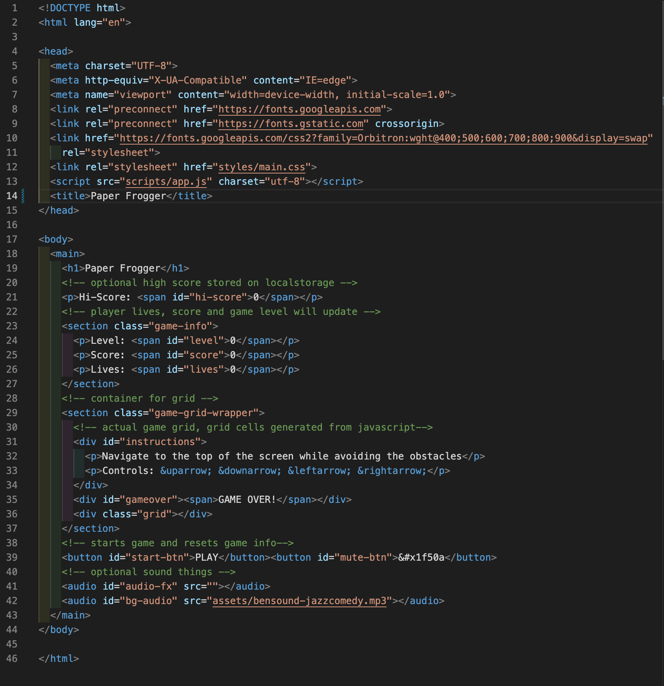
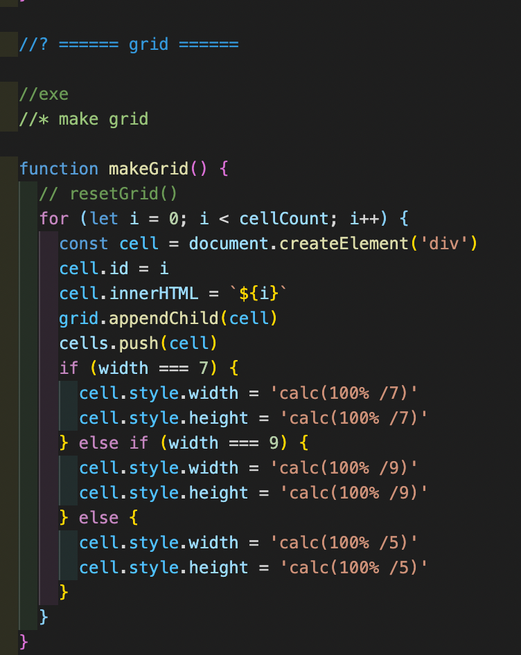

## SEI-project-one

# Paper Frogger

## Overview

The first of four projects on the Software Engineering Immersive course at General Assembly. For this solo project, we had a choice of games to select from and build it to our own theme. I chose frogger to apply what we learnt into making this game. 

Link to deployed game [Paper Frogger](https://matthewccs.github.io/SEI-project-one/) 

## Table of Contents

- [Project Brief](#project-brief)
- [Technologies Used](#technologies-used)
- [Getting Started](#getting-started)
- [Bugs/Missing Features](#bugs-missing-features)
- [Development Reflections](#development-reflections)
  - [Dev Journal](#dev-journal)
- [Upcoming Features](#upcoming-features)

## Project Brief

Solo Project
Time frame: 7 days 
Brief: Build a grid based game using HTML, CSS and JavaScript.  

## Technologies Used

#### Languages

#### Dev-Tools

## Getting Started

#### Controls

- Start button
- Up, Down, Left and Right arrows to control moment
- Mute button to stop music  .

#### Objectives

- Frogger is a game where you guide a frog from the bottom of the screen to the top while avoiding obstacles on the way. 

- For my game, each time a frog reaches home, the speed of the obstacles increases a little.

- You have three lives to get the highest score you can. Each time you collide with an obstacle or an obstacle collides with you you lose one life. Lose all three lives and it’s game over.

- You get 10 points by moving the frog either up, left or right. Moving backward will cost you 5 points. You get bonus points for advancing to the next level, the higher the level the more bonus points you'll receive. 

## Bugs/ Missing features

- High Score function using localStorage was not implemented in time
- Restarting the game causes previous existing obstacles to be carried over to the next game making the game significantly more difficult. This cannot be resolved without refreshing the browser.

## Development Reflections

Overall the build process was interesting and fun even when I had some bugs in the game. I originally planned to have selectable grid sizes to give users a difficulty option but due to time constraints I was unable to implement that feature.  

### Dev Journal

Click

### Approach

#### Day 1 - Planning 

I initially didn’t have a particular theme in mind so I started with a basic wire frame on what I wanted the game to look like structure wise and consider what features the game should have.

My approach
1. Setup HTML Structure
2. Do basic styling
3. Work on grid creation and player movement
4. Setup start and finish areas on the grid, checked they are properly logged
5. Add win condition and update player stats (score, life and level)
6. Add static obstacles and test collision detection
7. Add moving obstacles and lose condition
8. Add game start button, intro overlay and gameover overlay
9. Style the game based on theme
10. Add sound effects and background music

#### Day 2
Added all the html elements required and done some basic styling on what I want the game to look like. 

 

Created the grid using JavaScript and CSS flex-box, once this was done, created start and end positions for the player and mapped keyboard arrow keys to use for movement. I was hoping to make the grid size adjustable but this feature was cut due to time.

Used JavaScript to add start and finish classes to the first and last row of grid (This was done so the classes would match the grid size if it changed)  

Tested player movement and logged when character was on the start and finish rows.

#### Day 3 
Added ‘win’ condition - advance level by reaching top of screen. Originally I set up a separate function but found it easier to incorporate it into the player movement.
Introduced some static enemies to test collision, win/lose conditions and updating the player stats based on win/loss condition.

#### Day 4 
Removed the original randomly generated obstacles and added linear moving obstacles. Used different ways to add obstacles, the eventual solution is not the most elegant and will definitely require revisiting in the future. Refactored some code.

#### Day 5 
Created some graphics for the game based on a paper craft theme and added some sounds into the game. 
   

#### Day 6 
Finished off the styling and added a mute button.

### Challenges 
- managing interval timings
- obstacle placement, while static obstacles were fine moving objects didn’t quite function as intended
- using local storage to store the high score

### Wins  
Completing my first functional grid based JavaScript game
Collision detection
Player movement and grid constraints

## Upcoming Features/ bug fixes
- Implement high score feature
- Fix obstacle bug
- Difficulty selector/ level scaling mode

## Credits

- Music: [Jazz Comedy](https://www.bensound.com/royalty-free-music/track/jazz-comedy) by Ben Tissot at [BenSound.com](https://www.bensound.com/free-music-for-youtube-videos)
